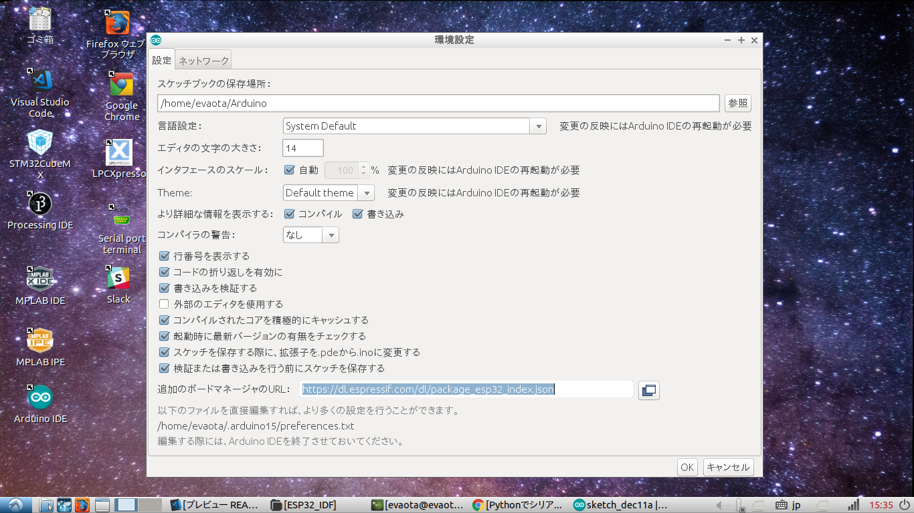

# Instruction install ESP32 development envirment on arduino IED

#### ***Expected Package before install Toolchain***
- git
- python3
- g++
    > sudo apt-get install g++ python3 git
- pyserial
    > sudo pip3 install pyserial
- Leatest Arduino IDE

- ## Add ESP32 borads on arduino

    1. input below URL in board manager URL box in enviroment configration
        > https://dl.espressif.com/dl/package_esp32_index.json   

        
    2. install esp32 board 
        

    Access ESP-IDF startup guide 

- ## API Reference and other documents
    Access [Espressif ESP32 official site](https://docs.espressif.com/projects/esp-idf/en/latest/get-started/linux-setup.html)

- ## NOTE
    - ### Disable boot message
        Default serial, boot message are output when reset,
        ~~~
        rst:0x1 (POWERON_RESET),boot:0x13 (SPI_FAST_FLASH_BOOT)
        ets Jun  8 2016 00:22:57

        rst:0x10 (RTCWDT_RTC_RESET),boot:0x13 (SPI_FAST_FLASH_BOOT)
        configsip: 0, SPIWP:0xee
        clk_drv:0x00,q_drv:0x00,d_drv:0x00,cs0_drv:0x00,hd_drv:0x00,wp_drv:0x00
        mode:DIO, clock div:1
        load:0x3fff0018,len:4
        load:0x3fff001c,len:952
        load:0x40078000,len:6084
        load:0x40080000,len:7936
        entry 0x40080310
        ~~~

        But, if you want to use Serial Plotter on arduino IDE. its msaages is not neccesary.   
        I recommend disabling it.   

        Let's connect IO15 of ESP32 to GND!!
    
        [Discussion Forum](https://www.esp32.com/viewtopic.php?t=1658)

    - ### WDT Mesures
        When you Serial monitor using Free RTOS.
        if monitor dislplayed below messages.
        ~~~
        Task watchdog got triggered. The following tasks did not reset the watchdog in time:
        - IDLE (CPU 0)
        Tasks currently running:
        CPU 0: Task1
        CPU 1: loopTask
        ~~~

        - Cause   
        ESP32 always excutes Watch dig timer.
        User must clear Watch dog timer counter not to triggerd Watch Dog timer.
        But you can not clear its in while loop.

        - Measures   
        put delay (1) or vTaskDelay (100 / portTICK_PERIOD_MS) in infinity loop.   
        But, its is unnecessary in "loop function of arduino"   
        Notes, if you create infinity loop in "loop function of arduino", delay function need in it;   

- ## sample codes
    ~~~c++
    #include "freertos/task.h"

    typedef struct
    {
        uint16_t rawData;
        float    voltage;
        float    Temperature;
    }SensorData;

    static SensorData sData;
    static uint8_t DAC_param; 

    void setup(void)
    {
        Serial.begin(115200);
        // Serial.println("start program!");
        // Serial.printf("setup() runs on core %d\n", xPortGetCoreID());
    
        xTaskCreate(LM35DZ_Read,"read",4096,&sData,1,NULL);
        // xTaskCreate(Display_temperature,"Report1_1",4096,&sData,2,NULL);
        // xTaskCreate(Plot_temperature,"Report1_2",4096,&sData,2,NULL);
        // xTaskCreate(DAC_SetParameter,"Report1_3",4096,NULL,2,NULL);
        // xTaskCreate(ADC2DAC,"Report1_4",4096,NULL,2,NULL);
        xTaskCreate(sendProcessing,"Report2",4096,&sData,2,NULL);
    }

    void loop(void)
    {
        while(1);
        {
            delay(1);
        }
    }

    void Display_temperature(void *pvParameters)
    {
        while(1)
        {
            Serial.println("Temperature is " + String(((SensorData*)pvParameters)->Temperature) + "Degree C");
            vTaskDelay(100 / portTICK_PERIOD_MS);
        }
    }

    void Plot_temperature(void *pvParameters)
    {
        while(1)
        {
            Serial.println(((SensorData*)pvParameters)->Temperature);
            vTaskDelay(1/portTICK_PERIOD_MS);
        }   
    }

    void DAC_SetParameter(void *pvParameters)
    {
        /*DAC pin : 25 or 26*/
        static uint8_t pinout = 25;
        
        DAC_param = 127;

        while(1)
        {    
            dacWrite(pinout,DAC_param); //8Bits DAC(MAX parameter 255)
            vTaskDelay(1/portTICK_PERIOD_MS);
        }
    }

    void ADC2DAC(void *pvParameters)
    {   
        while(1)
        {
            uint8_t volume = (uint8_t)(analogRead(A5)>>4);    //IO33	ADC1_CH5
            dacWrite(26,volume); //8Bits DAC(MAX parameter 255)

            Serial.println(analogRead(A6));//IO34 	ADC1_CH6
            
            vTaskDelay(1/portTICK_PERIOD_MS);        
        }
    }

    void LM35DZ_Read(void *pvParameters)
    {
        while(1)
        {
            /*ADC of ESP32 have 12bit resolutoons */   
            ((SensorData*)pvParameters)->rawData = analogRead(A16);   //IO14 ADC2_CH6
            ((SensorData*)pvParameters)->voltage = ((SensorData*)pvParameters)->rawData * (3600.f / 4096.f);
            ((SensorData*)pvParameters)->Temperature = (((SensorData*)pvParameters)->voltage - 400.f) / 19.5f;

            vTaskDelay(1/portTICK_PERIOD_MS);
        }   
    }

    void sendProcessing(void *pvParameters)
    {
        while(1)
        {
            Serial.print(((SensorData*)pvParameters)->rawData);
            vTaskDelay(100/portTICK_PERIOD_MS);
        }
    }
    ~~~

- ## Version

    |version  |Date|Contents|
    |:-----:|:-------:|:----------------|
    |ver1.0 |2017/6/27|add infomation of version|   
    |ver1.1 |2017/9/27|Updated Documents|
    |ver1.2 |2018/10/9|fixed layout|
    |ver2.0 |2018/12/11|only use arduino|

- ## License Information
   This software is released under the MIT License, see LICENSE