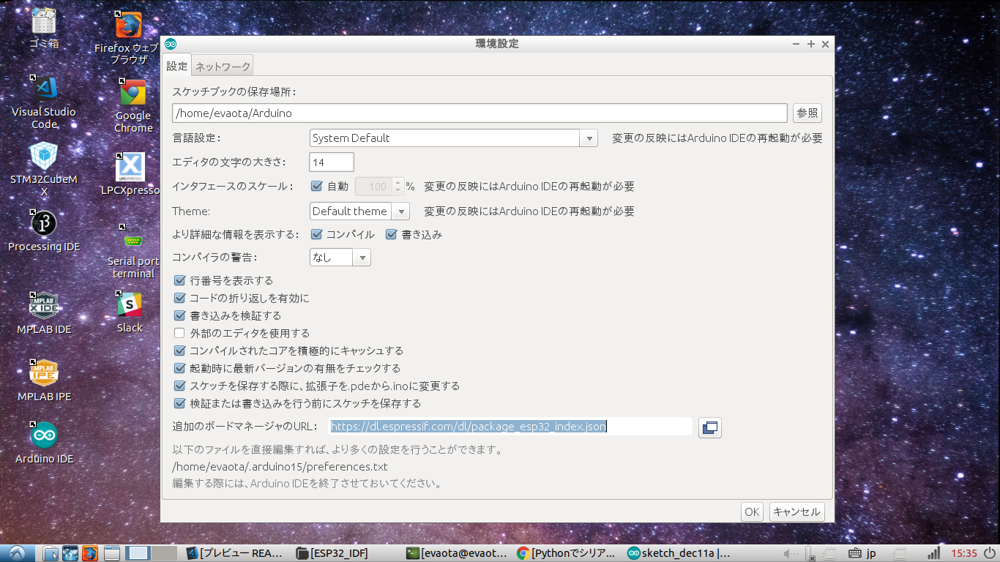
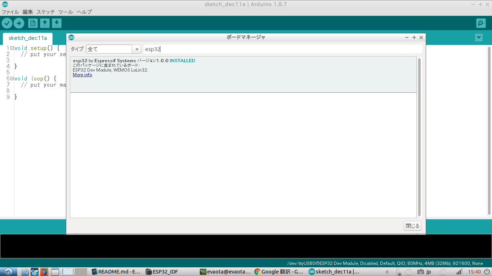

# Instruction install ESP32 & M5stack development envirment on arduino IDE

#### ***Expected Package before install Toolchain***
- git
- python3
- g++
    > sudo apt-get install g++ python3 git
- pyserial
    > sudo pip3 install pyserial
- Leatest Arduino IDE

- ## Add ESP32 boards on arduino

    1. input below URL in board manager URL box in enviroment configration
        > https://dl.espressif.com/dl/package_esp32_index.json   

        
    2. install esp32 board 
        

    Access ESP-IDF startup guide 
- ## Hardware difinition as Arduino(japanese)
    - [TIPS of about ESP32 by switch-sience](https://trac.switch-science.com/wiki/esp32_tips)   
    - [Article of ESP32](https://ht-deko.com/arduino/esp-wroom-32.html#17)
    - [M5stack Product Documents](https://docs.m5stack.com/#/en/)

- ## API Reference and other documents
    Access [Espressif ESP32 official site](https://docs.espressif.com/projects/esp-idf/en/latest/)

- ## How to use RTOS for ESP32
    - [KERI's Lab](https://kerikeri.top/posts/2017-06-24-esp32-dual-core/)   
    - [garretlab](https://garretlab.web.fc2.com/arduino/esp32/lab/task/index.html)

- ## M5stack Works
    - [mgo-tec電子工作](https://www.mgo-tec.com/)    
    - [mgo-tec電子工作 M5camera](https://www.mgo-tec.com/blog-entry-m5camera-arduino.html)    
    - [ 屋根裏実験室 M5Stackを使ってみる](http://itoi.jp/M5Stack.html)

- ## NOTE
    
    - ### Display TypeTrue font using ESP32
        https://garretlab.web.fc2.com/arduino/esp32/lab/truetype/index.html
    - ### Disable boot message
        Default serial, boot message are output when reset,
        ~~~
        rst:0x1 (POWERON_RESET),boot:0x13 (SPI_FAST_FLASH_BOOT)
        ets Jun  8 2016 00:22:57

        rst:0x10 (RTCWDT_RTC_RESET),boot:0x13 (SPI_FAST_FLASH_BOOT)
        configsip: 0, SPIWP:0xee
        clk_drv:0x00,q_drv:0x00,d_drv:0x00,cs0_drv:0x00,hd_drv:0x00,wp_drv:0x00
        mode:DIO, clock div:1
        load:0x3fff0018,len:4
        load:0x3fff001c,len:952
        load:0x40078000,len:6084
        load:0x40080000,len:7936
        entry 0x40080310
        ~~~

        But, if you want to use Serial Plotter on arduino IDE. its msaages is not neccesary.   
        I recommend disabling it.   

        Let's connect IO15 of ESP32 to GND!!
    
        [Discussion Forum](https://www.esp32.com/viewtopic.php?t=1658)

    - ### WDT Mesures
        When you Serial monitor using Free RTOS.
        if monitor dislplayed below messages.
        ~~~
        Task watchdog got triggered. The following tasks did not reset the watchdog in time:
        - IDLE (CPU 0)
        Tasks currently running:
        CPU 0: Task1
        CPU 1: loopTask
        ~~~

        - Cause   
        ESP32 always excutes Watch dig timer.
        User must clear Watch dog timer counter not to triggerd Watch Dog timer.
        But you can not clear its in while loop.

        - Measures   
        put delay (1) or vTaskDelay (100 / portTICK_PERIOD_MS) in infinity loop.   
        But, its is unnecessary in "loop function of arduino"   
        Notes, if you create infinity loop in "loop function of arduino", delay function need in it;   

- ## sample codes
    ~~~c++
    #include "freertos/task.h"

    #define TaskDelay(x)	vTaskDelay(x/portTICK_PERIOD_MS)

    void setup(void)
    {
        Serial.begin(115200);
        Serial.println("start program!");
        Serial.printf("setup() runs on core %d\n", xPortGetCoreID());
    
        xTaskCreate(Hello,"str1",4096,NULL,2,NULL);
        xTaskCreate(World,"str2",4096,NULL,2,NULL);
    }

    void loop(void)
    {
        while(1)
        {
            TaskDelay(1);
        }
    }

    void Hello(void *pvParameters)
    {
        while(1)
        {
            Serial.print("Hello");
            TaskDelay(1);
        }
    }

    void World(void *pvParameters)
    {
        while(1)
        {
            Serial.println("World");
            TaskDelay(1);
        }   
    }
    ~~~

- ## Version

    |version  |Date|Contents|
    |:-----:|:-------:|:----------------|
    |ver1.0 |2017/6/27|add infomation of version|   
    |ver1.1 |2017/9/27|Updated Documents|
    |ver1.2 |2018/10/9|fixed layout|
    |ver2.0 |2018/12/11|only use arduino|
    |ver2.1 |2018/12/13|update example|

- ## License Information
   This software is released under the MIT License, see LICENSE